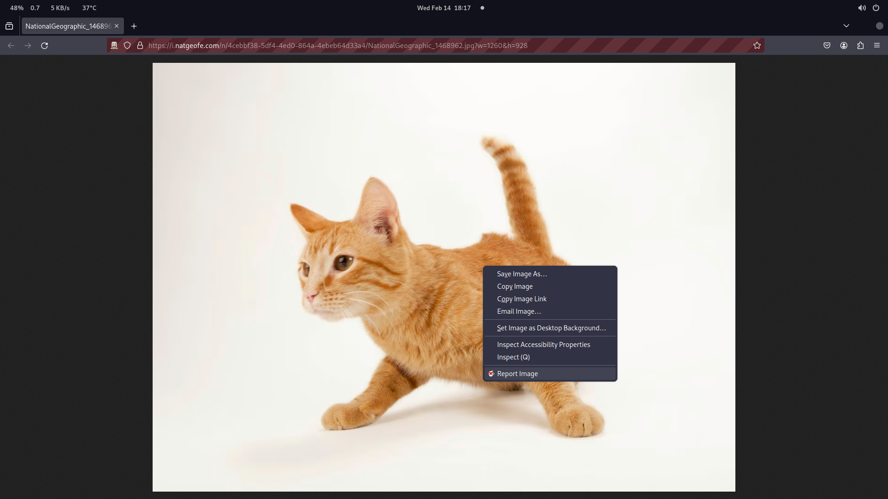
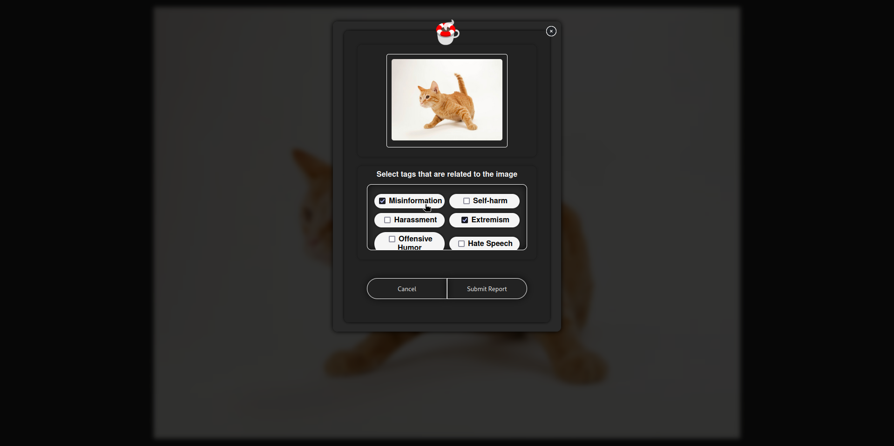
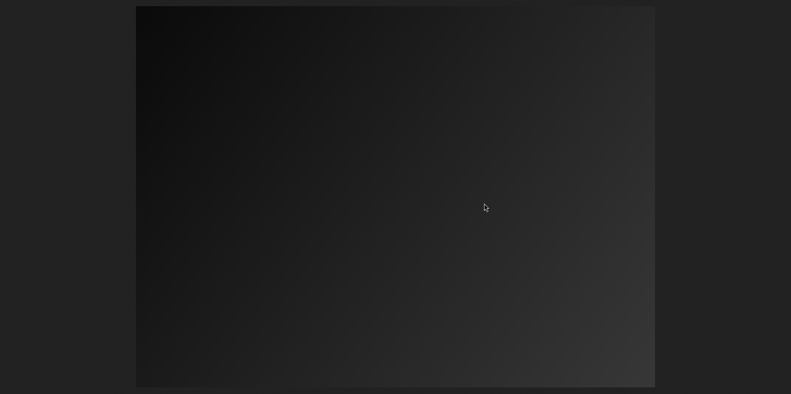

    

<h1 align="center">
     Good Vibes Preserver
</h1>

Good Vibes Preserver is a browser extension designed to enhance user experience during web browsing. 

It incorporates a comprehensive reporting system enabling users to report images along with specifying the corresponding tags. 

Furthermore, users can provide feedback on reported images utilizing a voting system, where they can cast positive or negative votes for each tag. 

## Image Reporting Example

### Select image and click on the Report Image context menu item.

### Select the tags that the image matches.

### The image will now be blocked.

