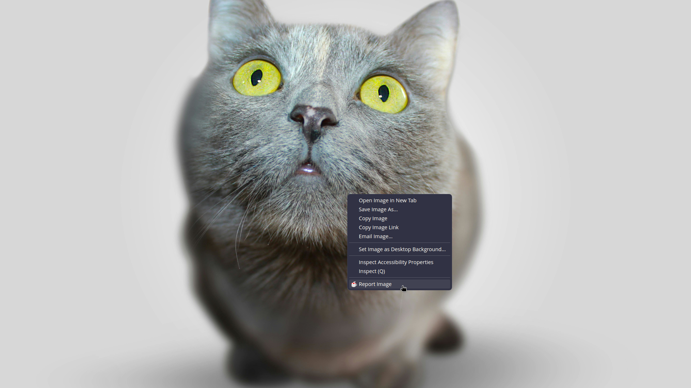

    

<h1 align="center">Good Vibes Preserver</h1>

## Available as [Firefox Extension](https://addons.mozilla.org/es/firefox/addon/good-vibes-preserver/)

This browser extension is designed to enhance user experience during web browsing by replacing undesirable content on web pages.

It incorporates a comprehensive reporting system enabling users to report images along with specifying the corresponding tags.

Users can provide feedback on reported images utilizing a voting system, where they can cast positive or negative votes for each tag.

The content blocking can be customized by allowing certain tags or whitelisting specific content.

---
## Image Reporting Example
### 1. Select image and click on the Report Image context menu item

### 2. Select the tags that apply for the image

### 3. The image will now be blocked

---
## Building from source
> [Bun](https://bun.sh) is used for managing packages and building the extension

> [Firefox Developer Edition](https://www.mozilla.org/en-US/firefox/developer) is used for testing

> [Python 3](https://www.python.org) is used for various tasks

### Getting started
* Clone the repository
* Open a terminal in the root of the source directory
* Execute `bun install` to get the dependencies
* Execute `bun run install` to generate an extension package for manually installing it as a temporary extension
  * \[Alternative\] Execute `bun run dev` to compile and launch **Firefox Developer Edition** with the extension
